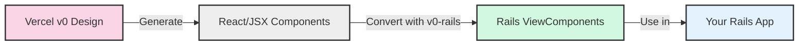
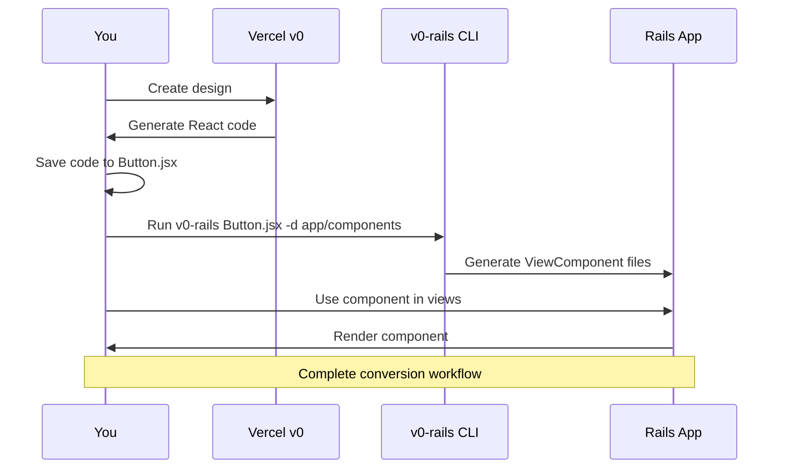
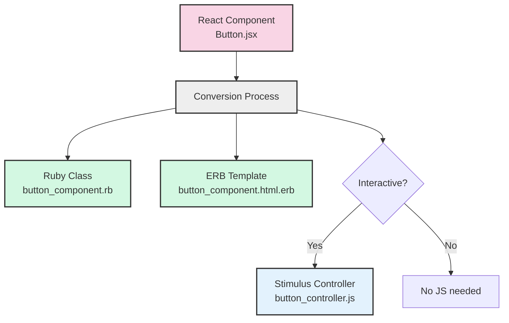
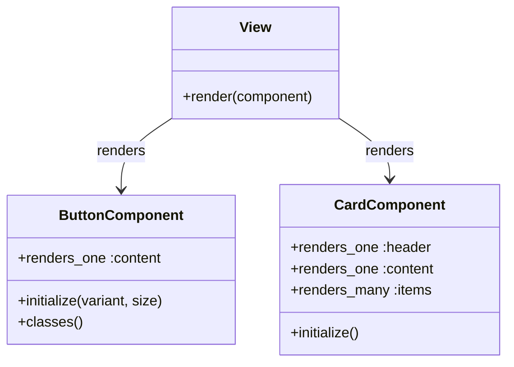
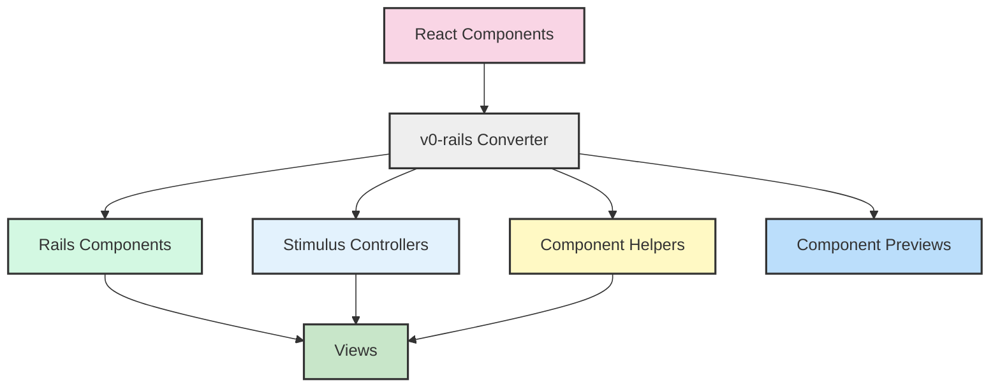
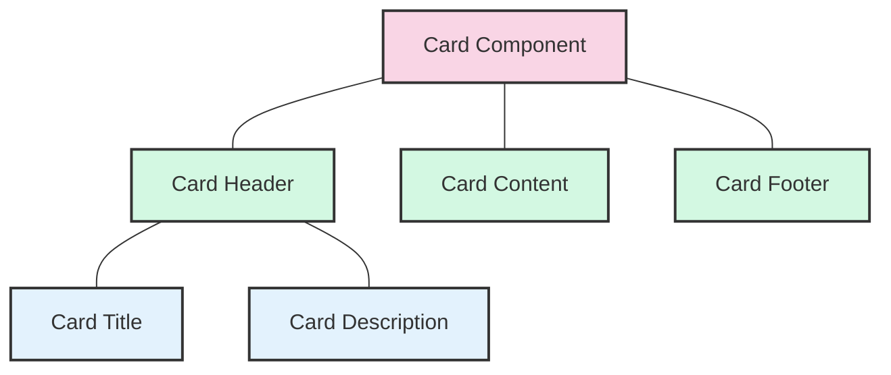
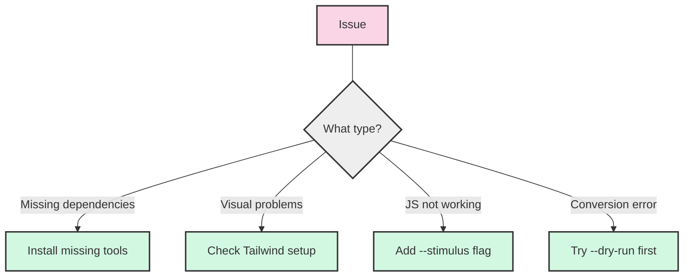

# v0-rails

A friendly tool to convert beautiful Vercel v0 designs into Rails applications without JavaScript complexity.

## What is v0-rails?

v0-rails is a conversion tool that helps you turn UI designs made with [Vercel v0](https://v0.dev/) (a design tool that creates React/JSX + Tailwind code) into Ruby on Rails components. This lets you use modern, beautiful designs in your Rails app without needing to use React.



### What problem does it solve?

As a Rails developer, you might love v0's beautiful UI designs but don't want to add React to your app. v0-rails bridges this gap by converting those designs to native Rails components.

### Benefits for beginners

* **Less JavaScript** - Use modern UI designs without learning React
* **Stay in Rails** - Keep your entire application in Rails without mixing frameworks
* **Faster pages** - Components render on the server for better performance
* **Easier maintenance** - Manage your UI in a single technology (Ruby/Rails)

## What is Vercel v0?

[Vercel v0](https://v0.dev/) is an AI-powered tool that creates beautiful UI designs. You describe what you want, and it generates the UI with React code and Tailwind CSS styling. v0-rails takes these designs and converts them to Rails.

## Before You Start

You'll need these tools installed:

* Node.js version 20 or newer
* Ruby version 3.3 or newer
* Rails version 7.1 or newer
* ViewComponent gem (version 3.9+)
* Stimulus (version 3.2+)

Don't worry if you're not familiar with all of these - we'll explain how they fit together!

## Installation

You can use v0-rails as either a Node.js command-line tool or a Ruby gem.

### Option 1: Install as a Node.js Tool

```bash
npm install -g v0-rails
```

This installs v0-rails as a command you can run from anywhere on your computer.

### Option 2: Install as a Ruby Gem

Add to your Rails app's Gemfile:

```ruby
gem 'v0_rails'
```

Then install it:
```bash
bundle install
```

## Getting Started (Simple Example)

Let's walk through a basic example of converting a v0 component:



### Step 1: Get a v0 design

First, visit [v0.dev](https://v0.dev/) and create a design (like a button, card, or form).
v0 will generate React code that looks something like this:

```jsx
// Button.jsx
export function Button({ children, variant = "primary", size = "medium" }) {
  return (
    <button className="rounded-md font-semibold bg-blue-500 text-white px-4 py-2">
      {children}
    </button>
  )
}
```

### Step 2: Save the v0 code

Save this code in a file (like `Button.jsx`) on your computer.

### Step 3: Convert to Rails

Now run the v0-rails converter:

```bash
v0-rails Button.jsx -d app/components
```

### Step 4: Use in your Rails app

The converter creates a ViewComponent you can use in your Rails views:

```erb
<%# In any Rails view %>
<%= render(ButtonComponent.new) do %>
  Click me!
<% end %>
```

That's it! Your v0 design is now a Rails component.

## Understanding the Conversion

When v0-rails converts a component, it creates:

1. A Ruby class (`app/components/button_component.rb`)
2. An ERB template (`app/components/button_component.html.erb`) 
3. Optional Stimulus controller for JavaScript interactions



You don't need to understand React to use these components - they work like regular Rails components.

## Common Use Cases

### Convert a Single Component

```bash
v0-rails src/components/Button.jsx -d app/components
```

This takes a single component file and converts it to a Rails component.

### Convert Multiple Components

```bash
v0-rails "src/components/*.jsx" -d app/components
```

This converts all JSX files in the components folder.

### Convert Components with Interactive Features

```bash
v0-rails "src/components/*.jsx" -d app/components --stimulus
```

The `--stimulus` flag adds JavaScript controllers for interactive elements.

## Step-by-Step Workflow

1. **Design**: Create UI components at [v0.dev](https://v0.dev/)
2. **Download**: Save the generated React components
3. **Convert**: Run v0-rails on those components
4. **Use**: Add the components to your Rails views

## Working with Components

### Component Structure



### Basic Example

```erb
<%# Simple button %>
<%= render(ButtonComponent.new(variant: "primary", size: "medium")) do %>
  Click me
<% end %>
```

### Components with Options

```erb
<%# Card with header and content %>
<%= render(CardComponent.new) do %>
  <%= render CardHeaderComponent.new do %>
    My Card Title
  <% end %>
  
  <%= render CardContentComponent.new do %>
    This is the card content.
  <% end %>
<% end %>
```

## Advanced Features (For When You're Ready)

As you get comfortable with v0-rails, you can explore more powerful features:

### Convert an Entire Application Structure

```bash
v0-rails "src/**/*.jsx" --dest app/components --stimulus
```

This converts all components in your source directory.



### Generate Rails Controllers from v0 Pages

```bash
v0-rails "src/app/**/*.jsx" --generate-controllers-from-structure
```

This creates Rails controllers based on your v0 page structure.

```mermaid
flowchart LR
    A[Next.js Page Structure] --> B[v0-rails]
    
    subgraph "Next.js/React Structure"
    A --> C[src/app/page.jsx]
    A --> D[src/app/about/page.jsx]
    A --> E[src/app/products/page.jsx]
    A --> F[src/app/products/[id]/page.jsx]
    end
    
    subgraph "Rails Structure"
    B --> G[HomeController#index]
    B --> H[AboutController#index]
    B --> I[ProductsController#index]
    B --> J[ProductsController#show]
    end
    
    style A fill:#f9d5e5,stroke:#333,stroke-width:2px
    style B fill:#eeeeee,stroke:#333,stroke-width:2px
```

### Configure Tailwind with shadcn Theme

```bash
v0-rails --configure-tailwind --shadcn-theme
```

Sets up your Tailwind configuration with the shadcn theme used in v0.

## Helpful Options Reference

Here are some useful options to try:

| Option | What It Does | When To Use It |
|--------|-------------|---------|
| `-d, --dest` | Sets where files are created | Always (to specify output directory) |
| `--stimulus` | Adds JavaScript for interactive elements | When your components have clickable parts |
| `--dry-run` | Shows what would change without making changes | To preview the conversion first |
| `--detect-slots` | Automatically detects component parts | For complex, nested components |
| `--enhanced-erb-conversion` | Better JSX-to-ERB conversion | For complex components with logic |

## Examples: Before and After

### Before (React/JSX)

```jsx
// Button.jsx
export function Button({ children, variant = "primary", size = "md" }) {
  const classes = `btn ${variant} ${size}`;
  
  return (
    <button className={classes}>
      {children}
    </button>
  );
}
```

### After (Rails ViewComponent)

```ruby
# button_component.rb
class ButtonComponent < ViewComponent::Base
  renders_one :content
  
  def initialize(variant: "primary", size: "md")
    @variant = variant
    @size = size
  end
  
  def classes
    "btn #{@variant} #{@size}"
  end
end
```

```erb
<!-- button_component.html.erb -->
<button class="<%= classes %>">
  <%= content %>
</button>
```

## Component Composition Example



React JSX:
```jsx
<Card>
  <CardHeader>
    <CardTitle>My Title</CardTitle>
    <CardDescription>Description here</CardDescription>
  </CardHeader>
  <CardContent>Main content goes here</CardContent>
  <CardFooter>Footer content</CardFooter>
</Card>
```

Rails ERB:
```erb
<%= render(CardComponent.new) do %>
  <%= render(CardHeaderComponent.new) do %>
    <%= render(CardTitleComponent.new) do %>My Title<% end %>
    <%= render(CardDescriptionComponent.new) do %>Description here<% end %>
  <% end %>
  <%= render(CardContentComponent.new) do %>Main content goes here<% end %>
  <%= render(CardFooterComponent.new) do %>Footer content<% end %>
<% end %>
```

## Troubleshooting

### Common Issues

**Issue**: Error about missing dependencies  
**Solution**: Make sure you've installed all the prerequisites (Node.js, Ruby, Rails, ViewComponent)

**Issue**: Components don't look right  
**Solution**: Make sure Tailwind CSS is set up in your Rails app

**Issue**: JavaScript interactions don't work  
**Solution**: Add the `--stimulus` flag when converting



## Getting Help

If you're stuck or have questions:

1. Check the examples in this documentation
2. Visit our GitHub repository issues section
3. Try a simplified example first, then expand

## What's Next?

As you get comfortable with basic conversions, explore the more advanced features like component composition, helper methods, and full application structure conversion.

## Contributing

Contributions are welcome! Please feel free to submit a Pull Request.

## License

This project is licensed under the MIT License - see the LICENSE file for details.

